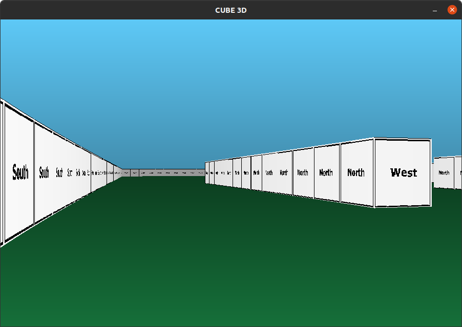

# 3dcube

## Installation
* Linux Depends: 
`$ sudo apt-get update && sudo apt-get install -y xorg libxext-dev zlib1g-dev libbsd-dev`
* Submodules: 
`$ git submodule update --init`

## Run
`$ ./cub3D maps/map.cub`
